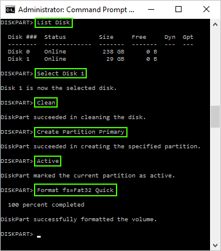

# Partition clearing

<!-- thumb-drive, USB-disk, USB-drive, USB-key, flashku -->
<!-- wipe, erase, repair, delete, fix, format, clear -->

Restore an USB flashdrive to its original (empty) state after it has gone bad (beyond repair by regular tooling)

## GNU/Linux (Debian)

### Delete old partitions:

---
_!!! WARNING !!! -- This irreversibly removes *everything* from the drive --- !!! WARNING !!!_

---

1. Become root:

	```
	$ su
	```

2. Find your USB drive letter (note / remember it for later use):

	```
	# fdisk -l
	```

3. Open the partitioning program _fdisk_ while targeting the correct partition:

	```
	$ fdisk /dev/<sdx>
	```
	> `sdx`: designation of _your_ flashdrive.

4. Proceed to the section to delete a partition:

	```
	: d
	```

5. Mark the first partition for deletion:

	```
	: 1
	```

	> _Note: This partition will be removed irretrievably once all changes are written to disk!_

1. Mark a next partition for deletion (fdisk should automatically select the next partition):

	```
	: d
	```

2.	Repeat according to your particular needs.


### Create new partition(s):

1. Make a new partition:

	```
	: n
	```

2. Make it a primary one:

	```
	: p
	```

3. Turn it into the first partition:

	```
	: 1
	```

4. Accept the default first cylinder:

	```
	:
	```

5. Accept the default last cylinder:

	```
	:
	```

### Finalize the process:

1. Write the proposed (new) partition scheme to the USB key:

	```
	: w
	```

	> _Note: This can NOT be undone!_

2. Unmount the USB drive:

	```
	$ umount /dev/<sdxi>
	```

	> `sdxi`: _your_ drive's partition-letter and number.

1. Format / write a (Fat32) file system:

	```
	$ mkfs.vfat -F 32 /dev/<sdx1>
	```

	> `sdxi`: _your_ drive's partition-letter and number.


## Microsoft Windows 7

### Delete old partitions:

---
_!!! WARNING !!! -- This irreversibly removes *everything* from the drive --- !!! WARNING !!!_

---

1. Navigate to: `[START] > Search`

2. Search for the command prompt program:

	```
	> cmd
	```

3. Right-click `cmd.exe` to open its context menu.

4. Choose: `open as administrator` to open the command prompt.

2. Open the partitioning program:

	```
	> Diskpart
	```

3. Print all disks on screen:

	```
	DISKPART> List disk
	```

4. Select the disk:

	```
	DISKPART> Select Disk X
	```

	>`X`: _your_ USB drive's disk-number.

5. Wipe the disk:

	```
	DISKPART> Clean
	```

	> _Note: This can NOT be undone!_

### Create new partition(s):

1. Make a primary partition:

	```
	DISKPART> Create Partition Primary
	```

2. Mark it active:

	```
	DISKPART> Activate
	```

3. Write the (Fat32) file-system (format) to the active partition:

	```
	DISKPART> Format fs=Fat32 Quick
	```

4. Leave the partitioning program:

	```
	DISKPART> Exit
	```

  


## Alternatives

### Windows

- GUI oriented tool: [SDFormatter][2]
- GUI oriented tool: [BOOTICE][3]


## References

- Adapted from: [Pendrivelinux][1]


<!-- References -->
[1]:https://www.pendrivelinux.com/restoring-your-usb-key-partition/
[2]: https://www.sdcard.org/downloads/formatter_4
[3]:http://bbs.wuyou.net/forum.php?mod=viewthread&tid=57675&extra=page%3D1&page=1
