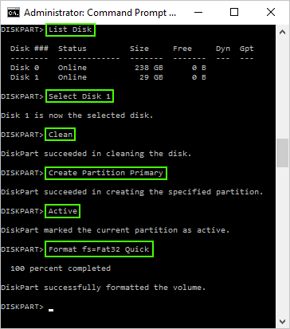

# Clear usb partions
Perform any of the following when an usb flashdrive (usbstick / thumbdrive) has gone bad beyound repair using regular tooling (and have _everything_ deleted from it).

## Microsoft Windows (7)

### Delete the old partitions that remain on the USB key

1. Open a command Prompt as administrator (cmd.exe).
1. Type: `Diskpart` and press Enter.
2. Type: `List Disk` and press Enter.
3. Type: `Select Disk X X` (where X X is the disk number of your USB drive) and press Enter.
4. Type: `Clean` and press Enter.

### Create new partition(s)

5. Type: `Create Partition Primary` and press Enter.
6. Type: `Active` and press Enter.
7. Type: `Format fs=Fat32 Quick` and press Enter.
8. Type: `Exit` and press Enter.

## Linux

### Delete the old partitions that remain on the USB key.

1. Open a terminal.
2. Type: `su` to become root.
3. Type: `fdisk -l` to find out (note) your USB drive letter.
4. Type: `fdisk /dev/sdx`(replacing **x** with your drive letter).
6. Type: `d` to proceed to delete a partition.
7. Type: `1` to select the 1st partition and press Enter.
8. Type: `d` to proceed to deleted another partition (fdisk should automatically select the next partition).

### Create new partition(s)

1. Type: `n` to make a new partition.
2. Type: `p` to make this partition primary and press Enter.
3. Type: `1` to make this the first partition and then press Enter.
4. Press **Enter** to accept the default first cylinder.
5. Press **Enter** again to accept the default last cylinder.
6. Type `w` to write the new partition information to the USB key
7. Type `umount /dev/sdx1` (replacing **x** with your drive letter)
8. Type: `mkfs.vfat -F 32 /dev/sdx1` (replacing **x** with your USB key drive letter).

## Alternatives

- GUI oriented (Windows) tool:[SDFormatter][2]
- GUI oriented (Windows) tool:[BOOTICE][3]

# References

- Adapted from: [Pendrivelinux][1]

<!-- References -->
[1]:https://www.pendrivelinux.com/restoring-your-usb-key-partition/
[2]: https://www.sdcard.org/downloads/formatter_4
[3]:http://bbs.wuyou.net/forum.php?mod=viewthread&tid=57675&extra=page%3D1&page=1
