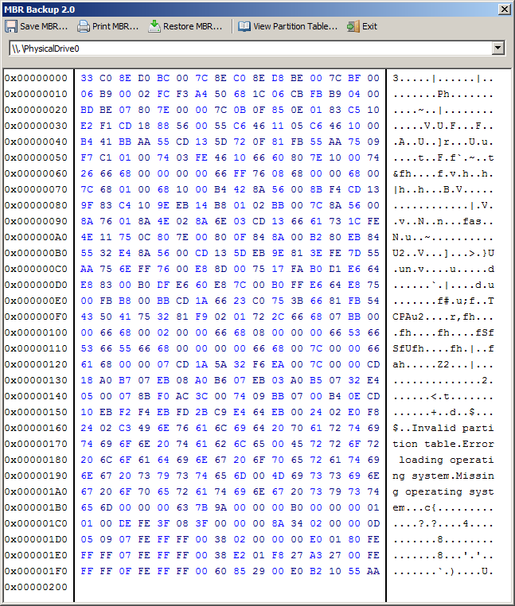

# Backup Master Boot Record (MBR)

> The Master Boot Record (MBR) is a special type of boot sector for Ms Windows, placed at the very beginning of the storage device. It tells your computer what to do when it starts. It also contains information on how your hard drive is partitioned. If the MBR is damaged or corrupted, whether by a boot sector virus, malware or by other means, you may find that the data on your hard drive is irretrievably lost.

## MBR Backup

> MBR Backup helps you create a backup of your Master Boot Record. If you ever need to restore it you know you will have a valid copy available. It offers two ways of backing up your MBR – to a file or by printing it:

Back up & Restore Master Boot Record in Windows 7 / 8:

1. **Click the executable** to open the program:

	

2. Save the MBR:

	- **Click [Save MBR...]** to safe the MBR to disk.

		> Use another block device to safe (to prevent loosing the backup along with its disk in case of failure).

	- **Click [Print MBR...]** to print the MBR to paper (or digital equivalent).

	>	Printing it is actually the safest method to back up your MBR, for several reasons:
	> * With a printout you always have a physical copy of the MBR at hand.
	>* No chance of saving the MBR to a file on the hard drive that gets corrupted.
	> * The MBR is only 512 bytes in size. Typing it in manually will be the least of your concerns if all your data is gone!

## References
* Adapted from (The Windows club): [mbr-backup-helps-you-backup-your-master-boot-record][1]
* MBR Backup download (official): [misec.net][2]
* MBR Backup download (2017-01-20): [MBR backup 2.0][3].

[1]:http://www.thewindowsclub.com/mbr-backup-helps-you-backup-your-master-boot-record
[2]:http://www.misec.net/products/mbr-backup/
[3]:assets/mbr_backup_2.0.exe
