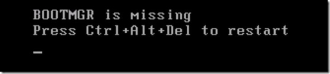
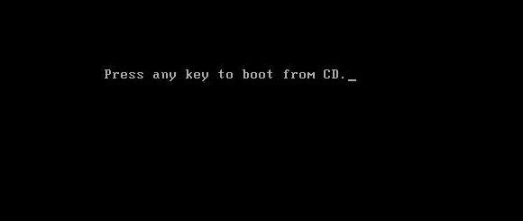
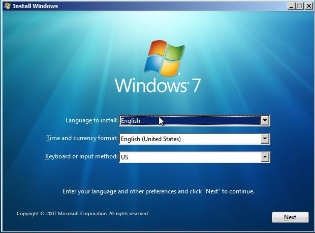
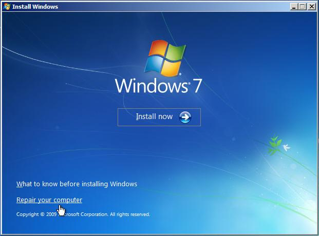
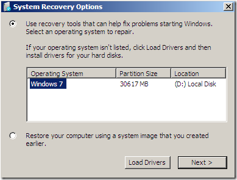
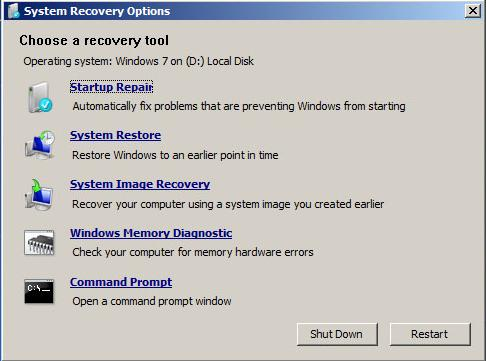

# Missing Bootmgr fix (Windows 10/8/7)

> A missing bootmgr is one of the most common boot issues in the Windows ecosystem. This can be fixed using a Win7 boot cd.


1. **Insert the Windows 7 Installation or Repair disk** into your drive.

2. **Reboot the System** to be prompted with: `Press any key to boot from disk`:

	

	> This step requires a corresponding boot preference order set in the BIOS or UEFI!

2.	**Press Enter** to be presented with the `Install Windows` dialog:

	

3. **Select your language** according to preference.

3. **Click [Next]** to be presented with the `Install Windows` dialog, including an option to `Repair your Computer`:

	

4. **Click 'Repair your computer'** to be presented with the `System Recovery Options`:

	

5.	**Check 'Use recovery tools...'** to specify you want to use the recovery _tools_ (in contrast to restoring an image).

6. **Select the operating system** at hand (i.e. Windows 7).

	> Simply ignore this step in case no operating systems are listed.

7. **Click [Next >]** to be presented with the `System recovery Options` tools:

	

8. **click 'Command Prompt'** to be presented with a dos terminal CLI:

9. **Issue the following commands** :

	```
	bootrec /fixboot
	bootrec /fixmbr
	bootrec /RebuildBCD
	```

	> Sometime you may need to change the directory from X:\Windows\System to C:\ first:
	> ```
	> X:\ c:
	> ```
	> Followed by the aforementioned commands.

10. **Reboot** to Windows!

	> In case it still does not boot into Windows run 'Startup Repair' 3 different times.

## References

- Also see: [Video tutorial][1]
- Adapted from (The Windows club): [fix-bootmgr-missing-windows-7][2]


<!-- REFERENCES -->

[1]:https://www.youtube.com/watch?v=j4KBjT-Xfgo
[2]:http://www.thewindowsclub.com/fix-bootmgr-missing-windows-7
