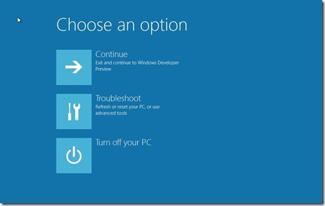
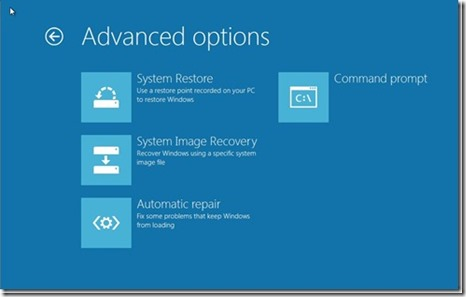
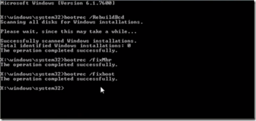
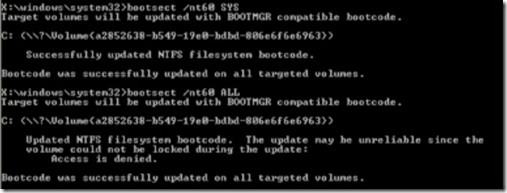
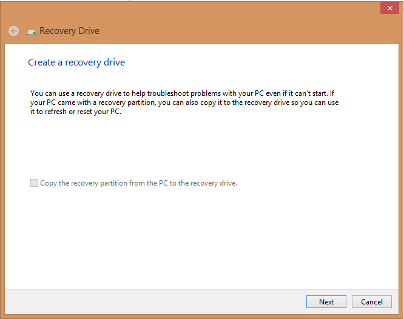

# Repair Master Boot Record (MBR) -- Windows 10 / 8 / 7

> SYMPTOMS: Common reasons why MBRs get corrupted are: malware infections, improper shutdowns, Linux Grub being installed and Windows is not able to detect it. On some occasions, you may get the Bootmgr is missing error. In such cases you can run the rebuild or repair MBR to fix these issues.

The process is almost same for Windows 10 / 8 / 7. First and foremost you need a Windows 8 or Windows 7 installation DVD.

1. **Boot the system while pressing [F8]** to go into the 'Windows Recovery Menu':

	> NOTE: Unlike other version Windows 8’s recovery menu has the Metro UI style:

	


2. **Click 'Troubleshoot'**.

3. **Click 'Advanced options'** to be presented to the `Automatic Repair` option:

	

4. **Click 'Automatic repair'** to get into the Automatic Repair menu.

5. **Click on command prompt** to be able to use the 'Bootrec.exe' tool.

6. **Issue the following commands**:

	```
	> bootrec /RebuildBcd
	> bootrec /fixMbr
	> bootrec /fixboot
	> Exit
	```
	

7. **Reboot the system**.

8. **Run some additional commands**, if required:

	```
	> bootsect /nt60 SYS
	> bootsect /nt60 ALL
	```

	


## Prevention

[Create a system recovery disk][1] with the latter for Windows 8:

1. **Open a DOS command prompt** to have a CLI:

 	```
	[Win]+[R]
	```

2. **Start the recovery drive utility** from the CLI:

 	```
	> RecoveryDrive.exe
	```

	

3. **Click  Next** to proceed to the next step:

4. **Insert an USB drive** and the program will start creating the Recovery (USB) drive.

> ALTERNATIVE: Make a backup of a functional Master Boot Record (MBR).

## References

>	Adapted from: The windows club
>	[Repair Master Boot Record (MBR) Windows][3]

>	Also see: The windows club
>	[Create a System Recovery Disk][1]

>	Also see: Youtube
>	[Video for Windows 7][2]

<!-- REFERENCES -->

[1]:http://www.thewindowsclub.com/create-recovery-drive-windows-8
[2]:https://www.youtube.com/watch?v=3xkMT8Hyhqc
[3]:http://www.thewindowsclub.com/repair-master-boot-record-mbr-windows
