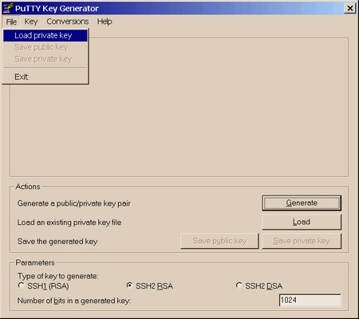
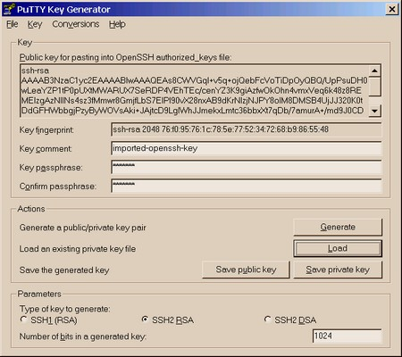

# Conversion

## Putty > OpenSSH

### Puttygen method

Export a private key generated by Putty to the OpenSSH format and subsequently create the public key in the OpenSSH domain:

 1. Open PuttyGen
	
 1. Click Load
 3. load the private key:
 	
 1. Go to `Conversions > Export OpenSSH`
 2. Export the private key
 1. Copy the private key to `~/.ssh/id_dsa` (or `id_rsa`).
 1. Create the RFC 4716 version of the public key using `ssh-keygen`:
 	```
	$ ssh-keygen -e -f ~/.ssh/id_dsa > ~/.ssh/id_dsa_com.pub
	```
 1. Convert the RFC 4716 version of the public key to the OpenSSH format:
 	```
	$ ssh-keygen -i -f ~/.ssh/id_dsa_com.pub > ~/.ssh/id_dsa.pub
	```
	> See [this][1] and [this][2] for more information.


### OpenSSH method

Convert the Putty generated key to an openssh formatted one:
```
$ ssh-keygen -i -f puttygen_key > /home/<username>/.ssh/authorized_keys/id_rsa
```

> `-i` declaring a conversion.
> `-f` defining the 'key to convert' file.

> This works for _unencrypted_ keys.  The public key is unencrypted, but the private one is probably encrypted.  I'm not sure if it there's a way to unencrypt the private key, convert it, and then recrypt it.  It may well be easier to use new keys as the other answer suggests (and I'd recommend using `ssh-agent` though that's orthogonal to the current issue).

<!-- ## OpenSSH > Putty -->


## References

> Adapted from: StackOverflow
> [How to convert ssh keypairs generated using puttygenwindows into key pairs use][3]

> Adapted from: AskUbuntu
> [How do I install a ssh private key generated by puttygen][4]

<!-- REFERENCES -->

[1]: http://linux-sxs.org/networking/openssh.putty.html
[2]: http://www.wellsi.com/sme/ssh/ssh.html
[3]:https://stackoverflow.com/questions/2224066/how-to-convert-ssh-keypairs-generated-using-puttygenwindows-into-key-pairs-use/2224204#2224204
[4]:https://askubuntu.com/questions/15378/how-do-i-install-a-ssh-private-key-generated-by-puttygen/15402#15402
